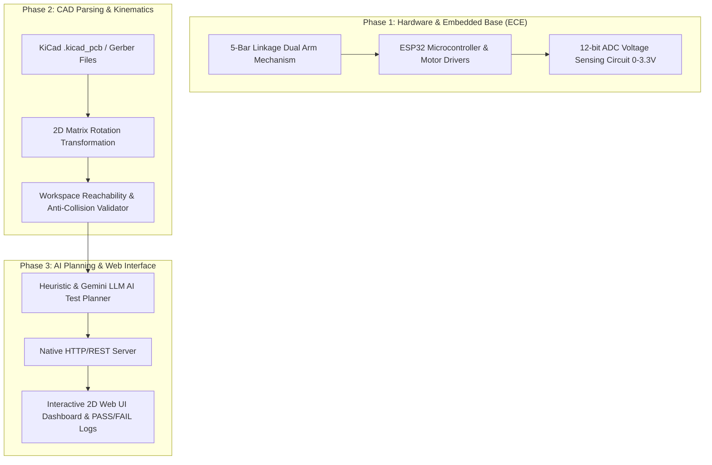

# 🛸 OpenFPT — Automated Flying Probe PCB Tester

<p align="center">
  
  
  
  
</p>

<p align="center">
  <b>An automated, open-source dual-arm flying probe PCB testing and quality assurance platform.</b><br>
  Parses raw KiCad & Gerber CAD files, uses AI pattern recognition & 5-bar linkage kinematics to plan probe paths, and executes real-time electrical continuity, short circuit, and ADC voltage diagnostics via ESP32 USB hardware dispatch.
</p>

---

## ⚡ One-Click Downloads

Like **G-Helper**, OpenFPT is packaged as a lightweight, zero-installation standalone executable. Download and run instantly without installing Python or external dependencies!

<p align="center">
  <a href="https://github.com/SUVITH63/Flying-probe-tester/releases">
    
  </a>
  &nbsp;&nbsp;&nbsp;&nbsp;
  <a href="https://github.com/SUVITH63/Flying-probe-tester/releases">
    
  </a>
</p>

> **Quick Launch (Windows):** Simply extract the `.zip` file and double-click **`OpenFPT.exe`** (or `OpenFPT-Launcher.bat`). It will automatically start the backend server and launch your web browser at `http://localhost:8000`.

---

## 🌟 Key Features

- **📄 KiCad & Gerber CAD Parser:** Parses `.kicad_pcb` (v5–v8 S-expressions) and `.gbr` Gerber copper layers. Computes 2D rotation matrix transformations to derive absolute pad locations and auto-centers the PCB to datum origin `(0.0, 57.5)`.
- **🤖 Dual-Engine AI Test Planner:**
  - *Heuristic Circuit Pattern AI:* Auto-detects Power/GND rails, I2C/SPI bus pull-ups, and signal traces to set expected min/max voltage bounds (`expected_min_v`, `expected_max_v`).
  - *Google Gemini LLM API:* Optional cloud AI integration for intelligent test plan optimization.
- **🦾 5-Bar Linkage Kinematic Engine:** Inverse kinematics validator enforcing physical linkage reach limits ($L_0=80\text{mm}, L_1=35\text{mm}, L_2=70\text{mm}$) and centerline single-arm crossing anti-collision rules ($Y=57.5\text{mm}$).
- **🔌 ESP32 Hardware & Virtual Simulator:** USB Serial dispatcher supporting physical ESP32 microcontrollers with 12-bit ADC voltage sensing, as well as a zero-hardware `SIMULATED_COM1` mode for software demonstrations.
- **🖥️ Live 2D Web Dashboard:** Zero-dependency native HTTP server delivering interactive 2D PCB rendering, probe arm trajectory animations, and live PASS/FAIL diagnostic reports.

---

## 🏗️ ECE System Architecture



---

## 🔌 ESP32 USB JSON Protocol

OpenFPT communicates with physical hardware over USB Serial (`115200 Baud`) using a lightweight JSON command protocol:

```json
{
  "msg_type": "run_test",
  "job_id": 101,
  "arms": [
    {"arm_id": 0, "x": -15.250, "y": 42.100},
    {"arm_id": 1, "x": 18.400, "y": 72.300}
  ],
  "test_params": {
    "tx_arm_id": 0,
    "rx_arm_id": 1,
    "tx_high_time_ms": 100
  },
  "meta": {
    "test_id": 1,
    "net": "GND",
    "expected_min_v": 3.15,
    "expected_max_v": 3.30
  }
}
```

---

## 💻 Quick Start from Source

If you prefer running from Python source code:

### 1. Clone Repository
```bash
git clone https://github.com/SUVITH63/Flying-probe-tester.git
cd Flying-probe-tester
```

### 2. Run PCB API Server
```bash
python pcb_api_server.py
```
> The server will start at **http://localhost:8000** and automatically open your default browser.

### 3. Run Automated Unit Tests
```bash
python -m unittest discover tests
```

---

## 🛠️ Building Standalone `.exe` from Source

To compile your own single-click `.exe` bundle using PyInstaller:

```bash
pip install pyinstaller
python build_exe.py
```
The compiled executable will be saved in `dist/OpenFPT/OpenFPT.exe`.

---

## 🤝 Project Credits & License

- **Team:** Andromeda / OpenFPT Team
- **Repository:** [SUVITH63/Flying-probe-tester](https://github.com/SUVITH63/Flying-probe-tester)
- **License:** MIT License
